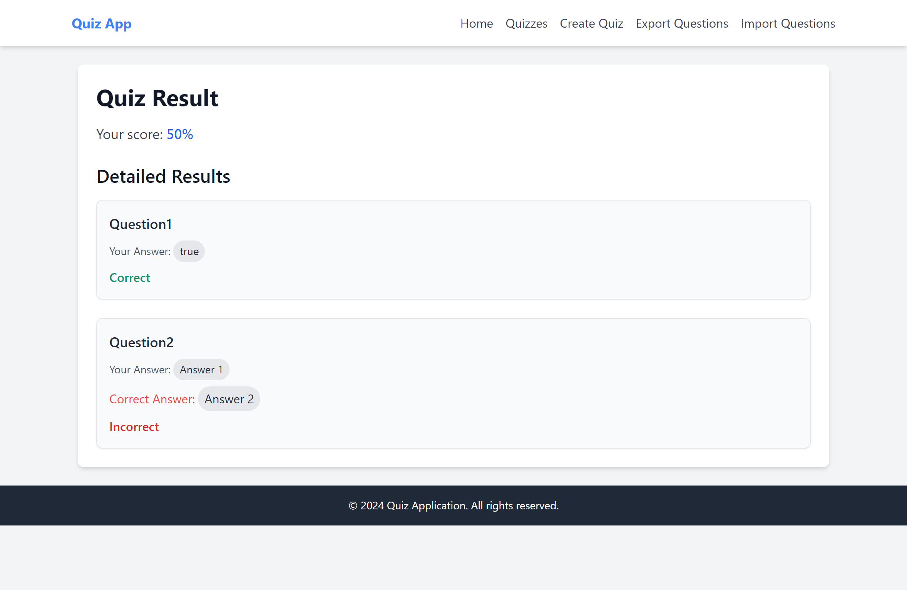

# Laravel Quiz System

A Laravel-based quiz management system that allows administrators to create quizzes with various question types, and users to take quizzes and see their results. This system also supports importing and exporting questions and answers using the Laravel Excel package.

## Features

- Create quizzes with multiple choice, true/false, and short answer questions.
- Users can take quizzes and view their results.
- Import and export questions and answers using Excel files.
- Easy management of questions and answers.

## Screenshots

Here are some screenshots of the application:

- **Quiz Import Page**

  
  
  
  
  


## Installation

1. Clone the repository:

```bash
   git clone https://github.com/cgdmohamed/LaravelQuizSystem.git
   cd LaravelQuizSystem
```

2. Install dependencies:
```bash
composer install
npm install
npm run dev
```
3. Copy the .env.example file to .env and configure your environment variables:
```bash
cp .env.example .env
```
4. Generate the application key:
```bash
php artisan key:generate
```

5. Running the Application
Start the development server:

```bash
php artisan serve
```
## Accessing the Application
Open your web browser and go to http://localhost:8000.

## Importing Questions
1. Navigate to the "Import Questions" page.
2. Upload an Excel file with the following columns:
- `question_text`
- `question_type` (multiple choice, true/false, or short answer)
- `answer_text`
- `is_correct` (true or false)

## Exporting Questions
1. Navigate to the "Export Questions" page.
2. Click the "Export" button to download an Excel file with the questions and answers.

## Contributing
1. Fork the repository.
2. Create a new branch (git checkout -b feature-branch).
3. Commit your changes (git commit -am 'Add new feature').
4. Push your changes (git push origin feature-branch).
5. Create a pull request.

## License
This project is licensed under the MIT License.

## Contact
If you have any questions or need further assistance, feel free to contact me.
